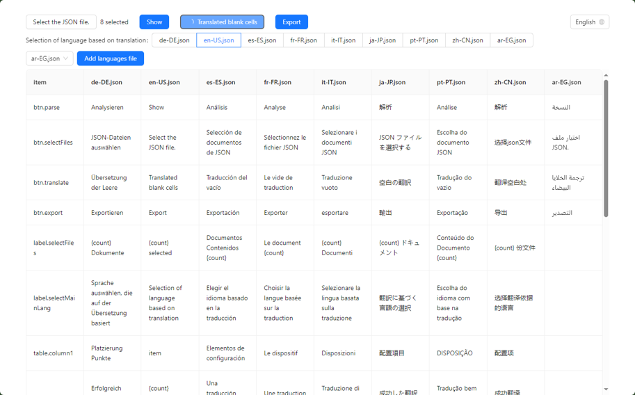

<h1 align="center">json-intl</h1>
<p align="center">
<span>

</span>
<span>

</span>
<span>

</span>
<span>

</span>
</p>

## 🤔 What is json-intl?

json-intl is a web app that provides translation support for react-intl files. It allows you to easily translate your app's text into multiple languages, making it accessible to a wider audience.

## 🌱 Screenshots


## ⭐ Features

- Supports simple JSON formats only
- Easy to use
- Supports multiple languages

## 👣 How to use

1. Import multiple JSON files.
   > The file names should be in the format <language>.json, where <language> is the language code (e.g., en-US.json).
2. Click the "Show" button.
   > This will parse the files and display them in a table.
3. Translate the empty cells.
    > 👍 Power by Cloudflare AI worker
4. Export the files as a .zip file.

## 🚀 Dev

```bash
yarn
yarn dev
```

## 📜 License

MIT License